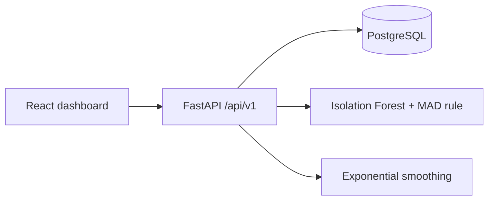
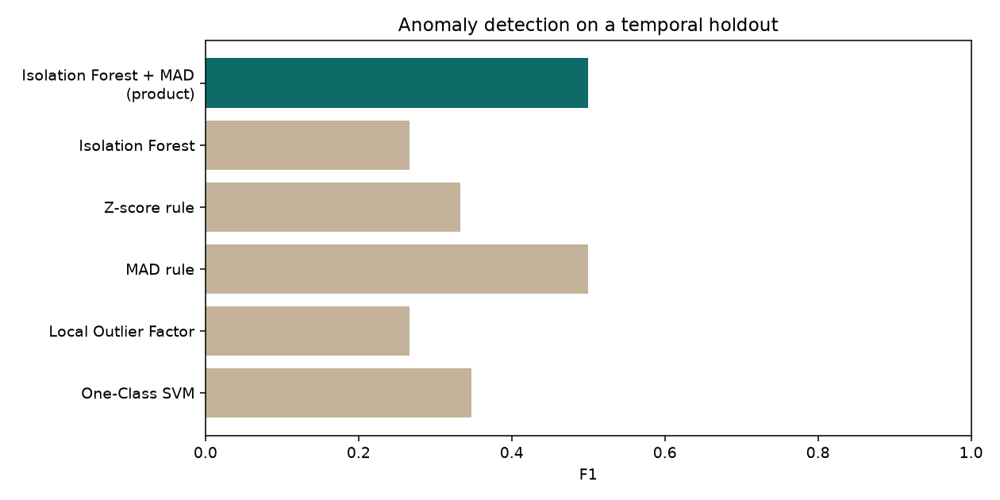
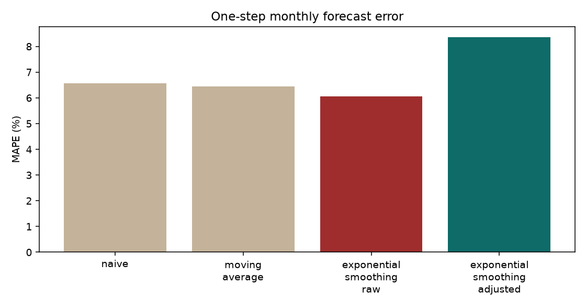
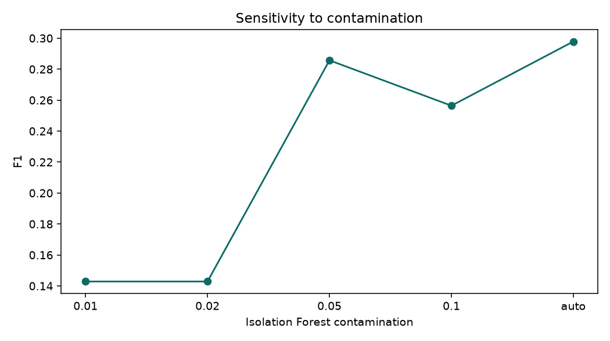

# Smart Personal Finance Tracker

An individual PBL-II project for JIIT. You record income and expenses. The app categorises them, flags unusual transactions with a short reason, and forecasts next-period spending **after** those anomalies have been replaced, so one spike does not drag the forecast.

## Run it

Docker is the supported setup (PostgreSQL 15, API, and the dashboard):

```bash
cd pfm
docker compose up --build
```

When the API is healthy, load the demo user:

```bash
make seed
```

Open http://localhost:3000 and sign in as `demo@example.com` / `Demo1234!`.

`make seed` resets that user's password, transactions, and budgets, then trains the anomaly model.

### Without Docker

Python 3.11 and Node 22. Use SQLite only for a local preview; the graded path is PostgreSQL via Compose.

```bash
cd pfm/backend
python -m pip install -r requirements-dev.txt
set DATABASE_URL=sqlite:///./pfm.db
python -m app.cli seed
python -m uvicorn app.main:app --port 8000
```

```bash
cd pfm/frontend
npm install
npm run dev
```

## Make targets

| Target | What it does |
| --- | --- |
| `make run` | `docker compose up --build` |
| `make seed` | Demo user plus 18 months of synthetic transactions |
| `make test` | Pytest with coverage (80% minimum) |
| `make lint` | Ruff, Black, and mypy |
| `make train` | Retrain the global model and every user model |
| `make evaluate` | Recompute metrics and rewrite `docs/evaluation.md` |
| `make migrate` | `alembic upgrade head` |

## What the demo shows

- **Dashboard** — income, expense, savings rate, category chart, six-month trend, budget bars.
- **Transactions** — filters, add form, CSV import, anomaly badge, and "this is normal / this is fraud".
- **Forecast** — raw exponential smoothing (dashed) against the anomaly-adjusted forecast (solid), with an interval.
- **Model metrics** — precision, recall, F1, ROC-AUC, PR-AUC, and MAPE / RMSE / MAE. The page reads `docs/evaluation_results.json`, which is produced by the evaluation script.

A five-minute script is in [docs/demo_script.md](docs/demo_script.md).

## Architecture



More detail, including the nightly retrain, is in [docs/architecture.md](docs/architecture.md). The HTTP surface is in [docs/api.md](docs/api.md) and at http://localhost:8000/docs.

Accounts with fewer than 50 transactions are scored with a global Isolation Forest trained on the synthetic generator. Larger accounts get their own model (`n_estimators=300`, `contamination=0.03`, `random_state=42`). A category amount above median + 3×MAD, and at least double the usual amount, is flagged as well. The stored reason is the two features that deviate most from that category, not a fixed sentence.

Before forecasting, flagged expense amounts are replaced with the category median. The raw series stays on the chart. Holt-Winters with a seasonal component is used only when there are at least 24 months; otherwise the fit is Holt, simple exponential smoothing, or a short moving average.

## Evaluation

`make evaluate` writes [docs/evaluation.md](docs/evaluation.md), `docs/evaluation_results.json`, and the charts below. Those numbers come from that script. The notebook [notebooks/evaluation.ipynb](notebooks/evaluation.ipynb) calls the same functions.







The Review 3 bug — an INR 9,500 outlier pulling the next forecast — is covered by `tests/test_ml.py` and by the evaluation report. On that series the raw forecast MAE is 3640 and the adjusted MAE is 0. On the 24-month synthetic holdout the product detector (Isolation Forest plus the MAD rule) reaches precision 0.467, recall 0.538, F1 0.500, ROC-AUC 0.739. Walk-forward monthly MAPE is 6.07% raw and 8.35% adjusted: the history is already smooth, so replacing a few normal rows does not help, which the report states directly.

## Tests and CI

GitHub Actions installs the backend, runs ruff, black, mypy, and pytest, then builds both Docker images.

## Limitations

- Access and refresh tokens are kept in `sessionStorage`. An httpOnly cookie would resist XSS better.
- The auth rate limit is in-memory and applies per process.
- Forecast intervals are ± 1.96 residual standard deviations, not a full state-space interval.
- Detection metrics are a temporal holdout on synthetic labels (spikes, duplicates, unfamiliar merchants, odd-hour payments). Duplicate charges of a normal amount are harder than large spikes.
- Walk-forward refits use 100 trees so the script finishes. The model used by the API uses 300.
- SQLite is for tests and a local preview. Compose runs PostgreSQL 15.
