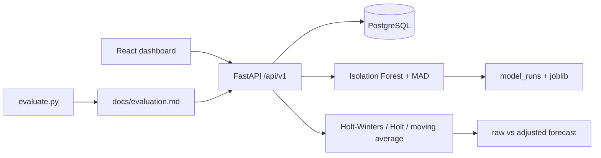

# Architecture

Smart Personal Finance Tracker stores each user's income and expenses, scores unusual transactions, and forecasts spending from a series that has had those anomalies replaced.

## Request path

1. The browser keeps the access token and refresh token in `sessionStorage` and sends `Authorization: Bearer` on API calls. A 401 triggers one refresh.
2. Every transaction, budget, and anomaly query filters on `user_id`. A missing row and another user's row both return 404.
3. After writes, the anomaly service scores the account. Accounts with fewer than 50 transactions use a global forest trained on the synthetic generator. Larger accounts get their own forest (`n_estimators=300`, `contamination=0.03`, `random_state=42`). `0.03` matches the rate of injected anomalies; the sensitivity table in the evaluation report includes `"auto"`.
4. A median-absolute-deviation rule flags an amount above the category median plus three MADs. The stored reason is the two features that deviate most from that category.
5. The forecast builds monthly or weekly expense totals twice: once raw, once after replacing a flagged amount with the category median when it is at least three times that median. Exponential smoothing fits both. Seasonal Holt-Winters is used only when there are at least 24 months (or 104 weeks). Shorter series use Holt, simple exponential smoothing, or a 3-point moving average.

## Nightly retrain

Docker Compose sets `ENABLE_SCHEDULER=true`. APScheduler runs `train_all_users` at 02:15. The same job is `make train`.
